# 微服务架构

## 1、配置中心

采用spring cloud config做为框架的配置中心，所有配置文件均采用GIT进行管理，实现配置文件的版本化和统一管理

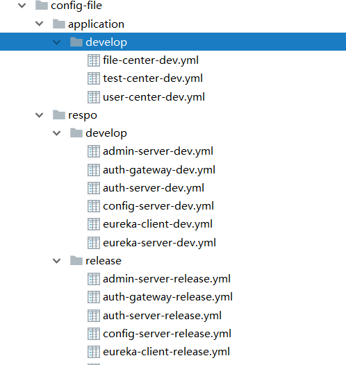


## 2、服务注册

采用spring-cloud-starter-netflix-eureka-server管理服务的注册

## 3、服务发现

采用spring-cloud-starter-netflix-eureka-client管理服务的注册

## 4、服务调用

4.1. 服务之间的调用采用Spring Cloud Feign组件实现，Feign组件具有负载均衡功能，在服务中需要调用另外服务时，Feign提供的负载均衡能力可以提高系统的可用性。

```java
@FeignClient(value = "api-test",fallback = UserServiceFallback.class)
public interface TestUserClient {

    /**
     * 获取当前用户
     * @return
     */
    @GetMapping("/test/current")
    LoginAppUser getLoginAppUser();

    /**
     * 根据用户ID查找用户
     * @return
     */
    @GetMapping("/test/{id}")
    SysUser findUserById(@PathVariable(value="id") Long id);
	
    /**
     * 根据用户ID查找用户，不需要权限
     * @return
     */
    @GetMapping("/open/user/{id}")
    public SysUser findById(@PathVariable(value="id") Long id);

}
```

4.2. 服务异常情况，默认返回

```java
@Component
public class UserServiceFallback implements TestUserClient {

    @Override
    public LoginAppUser getLoginAppUser() {
        return new LoginAppUser();
    }

    @Override
    public SysUser findUserById(Long id) {
        return new SysUser();
    }

    @Override
    public SysUser findById(Long id) {
        return new SysUser();
    }

}
```


## 4、权限控制

采用SpringSecurity + Oauth2技术进行权限认证，并实现了一个基于URL资源访问的权限管理系统

用户管理：

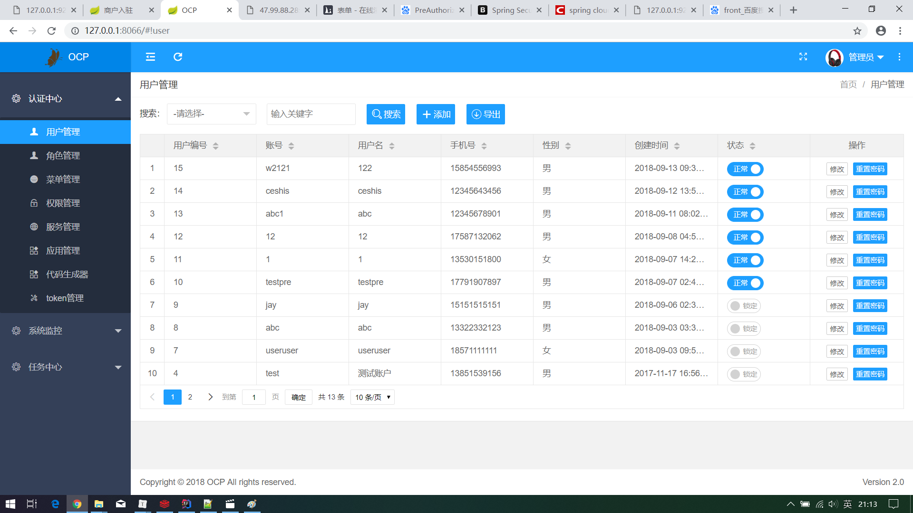

角色管理：

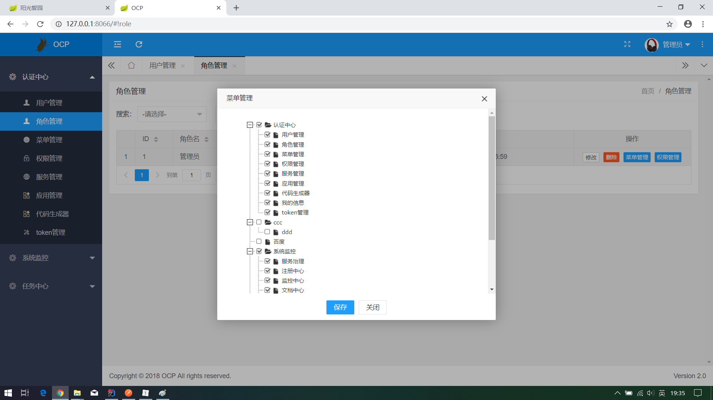

菜单管理：

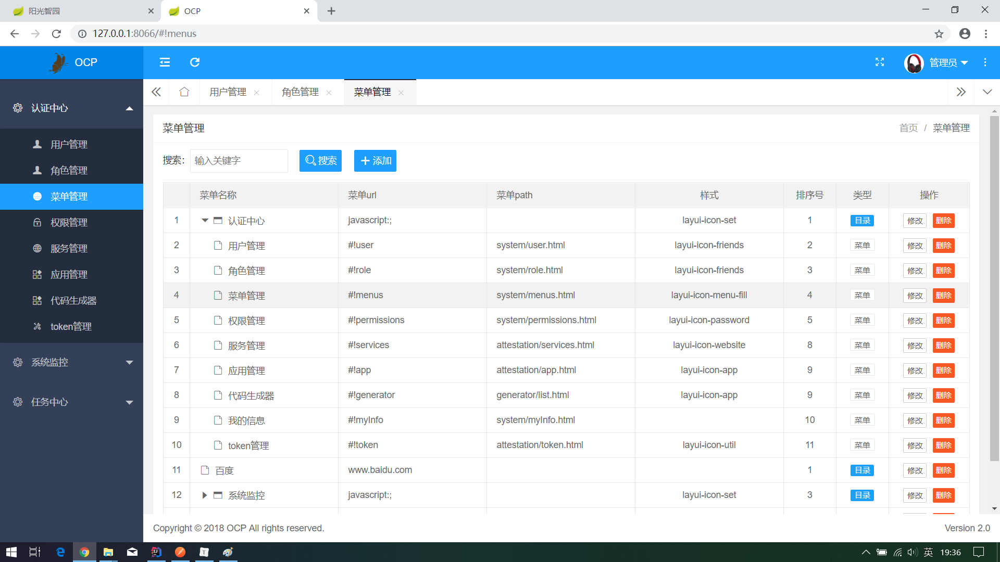

权限管理：

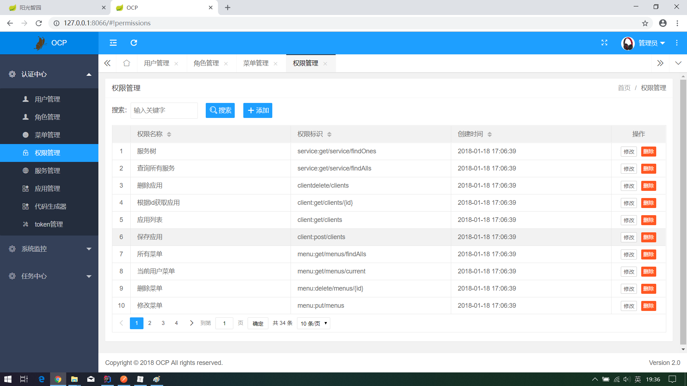

应用管理：

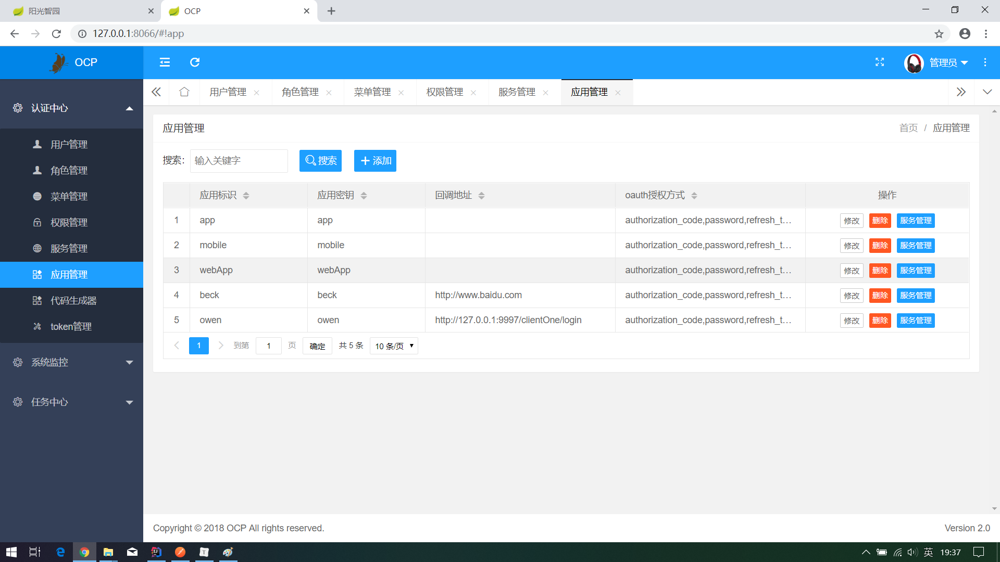

登陆用户管理：

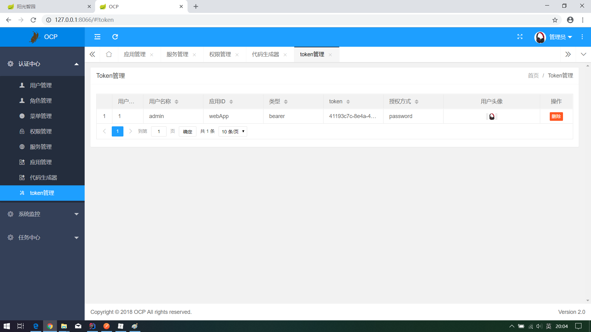


## 5、数据校验

具有基于后台的接口数据校验功能，能够防止直接调用接口，提交垃圾数据

```java
String username = sysUser.getUsername();
if (StringUtils.isBlank(username)) {
    throw new IllegalArgumentException("用户名不能为空");
}
// 防止用手机号直接当用户名，手机号要发短信验证
if (PhoneUtil.checkPhone(username)) {
    throw new IllegalArgumentException("用户名要包含英文字符");
}
// 防止用邮箱直接当用户名，邮箱也要发送验证
if (username.contains("@")) {
    throw new IllegalArgumentException("用户名不能包含@");
}

if (username.contains("|")) {
    throw new IllegalArgumentException("用户名不能包含|字符");
}

if (StringUtils.isBlank(sysUser.getPassword())) {
    throw new IllegalArgumentException("密码不能为空");
}

if (StringUtils.isBlank(sysUser.getNickname())) {
    sysUser.setNickname(username);
}
```


## 6、数据分库

在框架中根据功能进行划分，功能相对独立的模块采用单独的数据库存储数据，从而提高数据库的可用性。

应用场景：

例如：用户注册功能要完成记录用户信息，日志信息，用户头像，分配默认权限。需要操作四张数据表完成数据写入操作。

高并发场景下，所有写入操作都操作同一个数据库实例，会造成数据库性能瓶颈。如果将用户信息，日志信息，头像信息，权限信息拆分为四个不同的数据，每一个数据承担四分之一的写入操作，会有效提高写入并发相应时间。

为服务方式数据进行拆分，根据业务重要性和对立性进行划分，将业务功能要求高度事务一致性的数据划分到一个数据库中，业务功能独立的数据划分到一个数据库中。

目前对数据进行划分：

1、业务数据库

主要存储业务数据，（入驻商户信息，订单信息等）

2、后台管理用户

主要存储后台管理用户信息，权限信息等

3、日志数据

主要存储后台用户操作记录

4、文件记录

主要存储用户上传的文件信息


## 7、服务监控

服务治理：

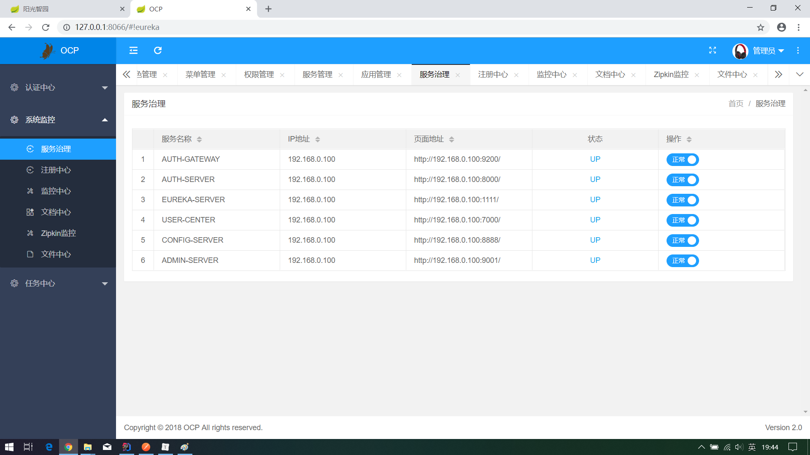

注册中心：

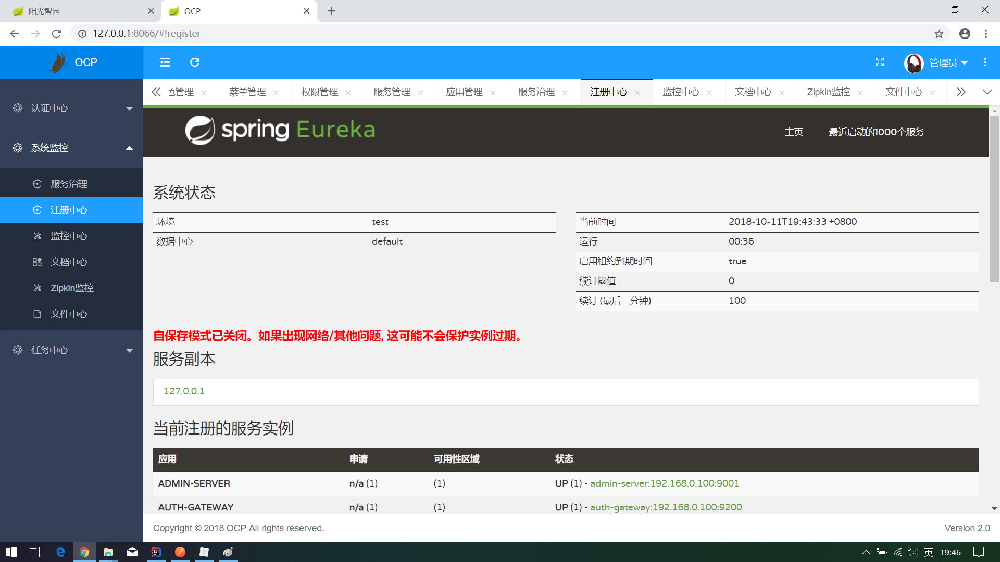

文件中心:

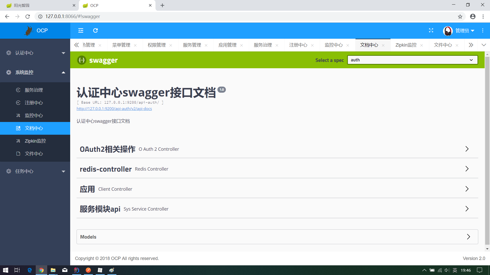

Redis使用情况：

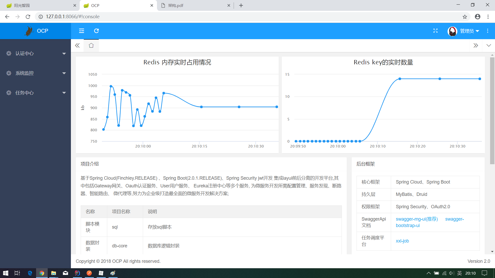

## 8、系统划分

系统划分为业务系统和内管系统（后台系统），业务系统是给普通用户使用的系统，内管系统是给公司内部运营人员使用的系统。


